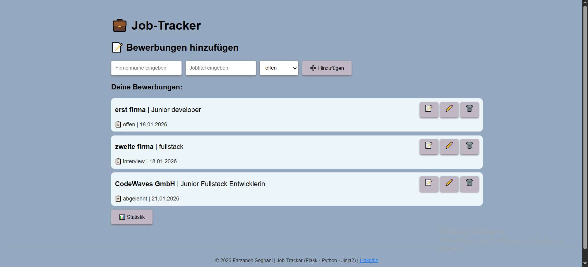
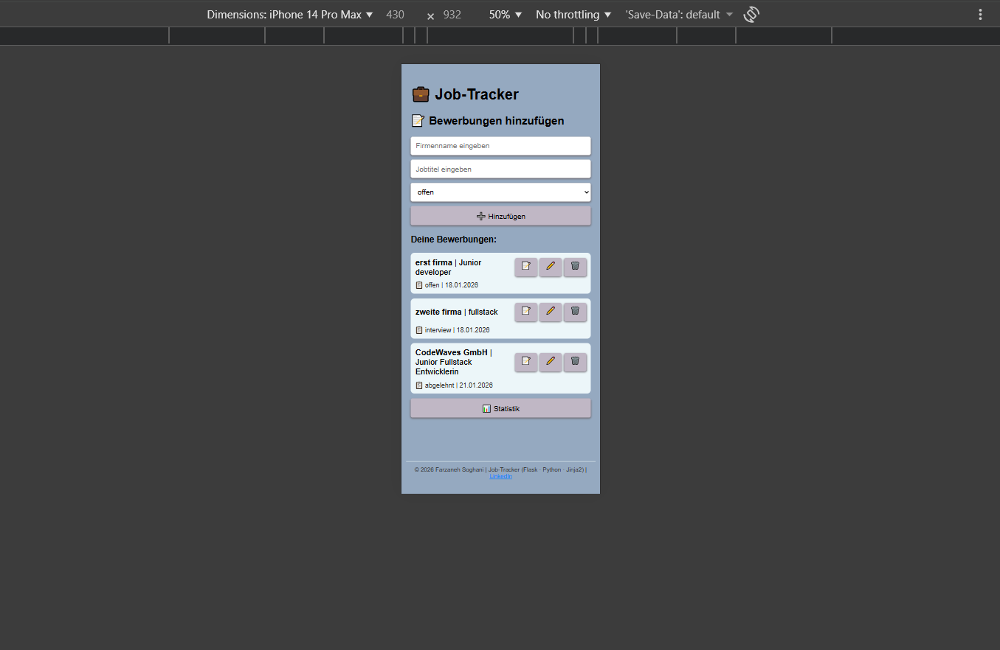
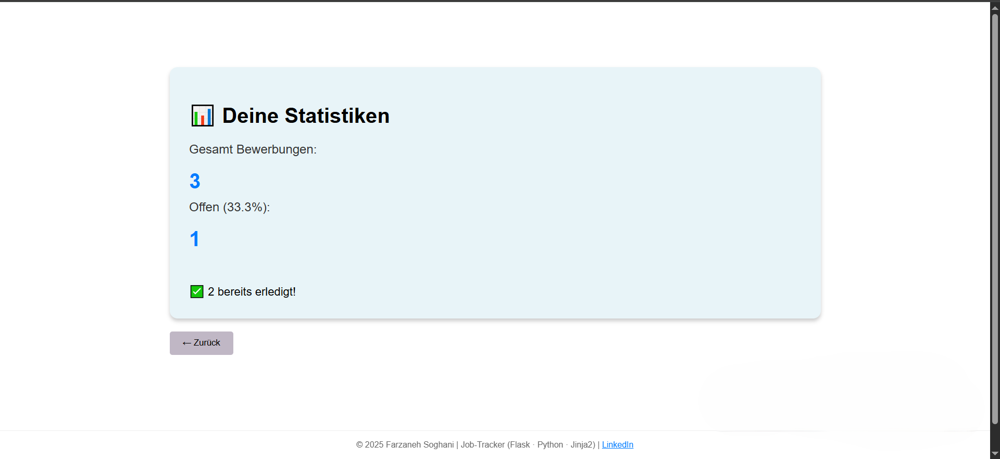
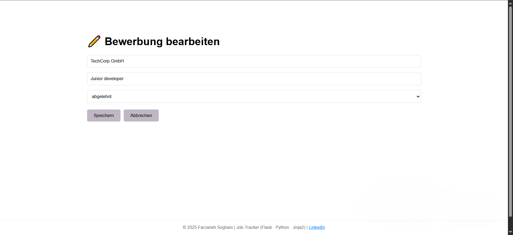
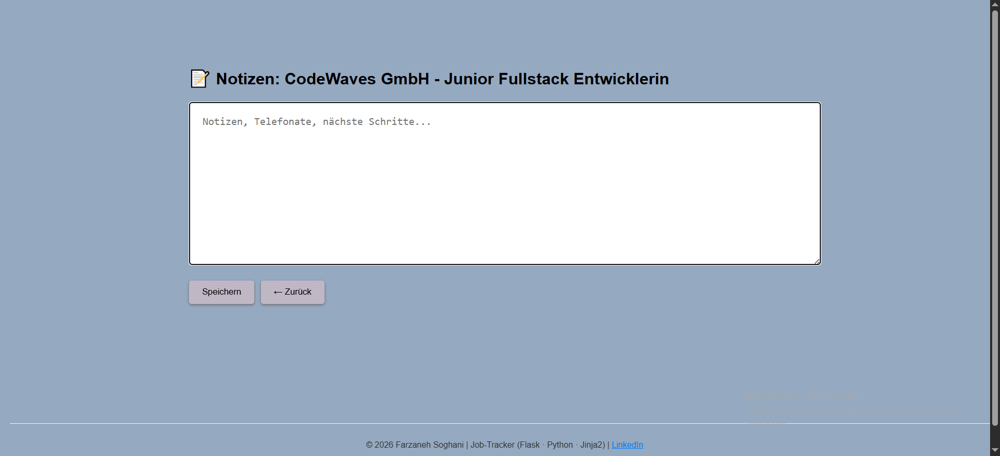

# 💼 **JobTracker** - Bewerbungs-Tracker 📊

## 🎯 Bewerbungen im Überblick  

**Flask Web-App für Bewerbungs-Management (Single-File Architektur)**  
> **Speichere Firmen, Positionen, Status & Deadlines.**  
> **Bringe Ordnung in deine Jobsuche** - filtere, sortiere, tracke **alles auf einem Bildschirm!**

📱 **Unterwegs? KEIN Problem!** Responsiv für **Handy + Desktop** - deine Bewerbungen immer dabei! 🚀  
> **Im Handy oder Desktop direkt im Browser eingeben: [https://farzanehsoghani-jobtracker.onrender.com](https://farzanehsoghani-jobtracker.onrender.com)**

Oder unten auf **"Live Deployed"** Button klicken  

## 🌐 Live Demo

[](https://farzanehsoghani-jobtracker.onrender.com)  

## 🚀 Features

- ✅ Vollständiges **CRUD** (Create, Read, Update, Delete)
- 📝 **Notizen** pro Bewerbungen
- 📱 **Responsive Design** (max-width: 1000px, @media 768px)
- 💾 **Session + Browser-Fingerprint** Storage (365 Tage persistent)
- 📈 **Live Statistics Dashboard** (`/stats`)
- ⏱️ **Automatisches Bewerbungserstellungsdatum** (DD.MM.YYYY)
- 🎨 **Clean Flexbox UI** + Mobile-First Design  

## 🏁 Quick Start

```bash
pip install -r requirements.txt
python app.py
```

→ Browser öffnet automatisch! 🎉

## 📸 Screenshots  

| Desktop Dashboard                 | Mobile Dashboard                | Statistics                    | Edit Form                   | Notizen                       |                  
|-----------------------------------|---------------------------------|-------------------------------|-----------------------------|-------------------------------|
||||||

## 🛠️ Tech Stack  
**Fullstack Job Tracker App**

- **Frontend:** HTML5 + CSS3 Flexbox + Media Queries (responsive)
- **Backend:** Python + Flask + Jinja2 Templates  
- **Storage:** Session-based + Browser Fingerprint
- **Features:** Flash-Messages + Live Stats + Vollständiges CRUD
- **Deployment:** GitHub Actions → Render → **Cloudflare CDN** ✅

## 📁 Projektstruktur

**Auflistung der Ordnerpfade**  
*(Automatisch generiert mit `tree /f` command)*  

```txt
C:.
│
├── app.py # Flask Backend + Bewerbungslogik
├── requirements.txt # Flask 3.0.3 + pytest 7.4.0 + gunicorn
├── Procfile # Render Deployment
├── pytest.ini # Test-Konfiguration
├── struktur.txt # Lokale Projektnotizen
│
├── .github/
│ └── workflows/
│ └── ci.yml # GitHub Actions CI/CD
│
├── templates/ # HTML/Jinja2 Templates
│ ├── index.html
│ ├── stats.html
│ ├── edit.html
│ └── notes.html
│
└── tests/
└── test_app.py # pytest Unit-Tests
```  

**💼 Made with ❤️ in Hamburg | [🔗 LinkedIn](https://www.linkedin.com/in/farzaneh-soghani/)**
