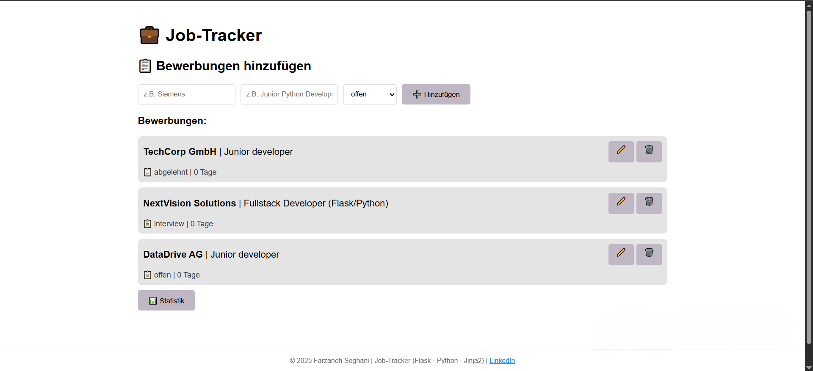

# 💼 **JobTracker** - Bewerbungs-Tracker 📊

## 🎯 Bewerbungen im Überblick

> **Speichere Firmen, Positionen, Status & Deadlines.**  
> **Bringe Ordnung in deine Jobsuche** - filtere, sortiere, tracke **alles auf einem Bildschirm!**  
>
> 📱 **Auch unterwegs? KEIN Problem!** Responsiv für **Handy + Desktop** - deine Bewerbungen immer dabei! 🚀  
> **Bringe Ordnung in deine Jobsuche - überall!**

*Flask Web-App für Bewerbungs-Management (MVC Pattern)*  

## 🌐 Live Demo

[](https://web-job-tracker-3.onrender.com)

## 🚀 Features

- ✅ Vollständiges CRUD (Create, Read, Update, Delete)
- 📱 Responsive Design (max-width: 1000px)
- 💾 JSON Persistence (bewerbungen.json)
- 📈 Live Statistics Dashboard
- ⏱️ Automatischer Tage-Zähler
- 🎨 Clean UI (Flexbox + versteckte Scrollbar)

## 🏗️ MVC Architektur  

- Model: job.py (Daten + Business-Logik)
- Service: job_manager.py (CRUD + JSON)
- Controller: app.py (Flask Routes)
- View: templates/ (Jinja2 + HTML5)

## 🏁 Quick Start

```bash
pip install -r requirements.txt
python app.py
```

→ Browser öffnet automatisch! 🎉

## 📸 Screenshots  

| Dashboard                              | Statistics                         | Edit Form                        |
|----------------------------------------|------------------------------------|----------------------------------|
| |     |     |

## 🛠️ Tech Stack  

- Frontend:  HTML5 + Jinja2 + Vanilla CSS (Flexbox)
- Backend:   Flask 3.0.0 + Python 3.x
- Database:  JSON File Storage (bewerbungen.json)
- Deployment: GitHub + Render ready

## 📁 Projektstruktur

**Auflistung der Ordnerpfade**  
*(Automatisch generiert mit `tree /f` command)*  

```txt
C:.
│   .gitignore
│   app.py
│   LICENSE
│   Procfile
│   README.md
│   requirements.txt
│   struktur.txt
│   
├───screenshots
│       dashboard.png
│       edit.png
│       stats.png
│
└───templates
        base.html
        edit.html
        index.html
        stats.html
```  

**💼 Made with ❤️ in Hamburg | [🔗 LinkedIn](https://www.linkedin.com/in/farzaneh-soghani/)**
